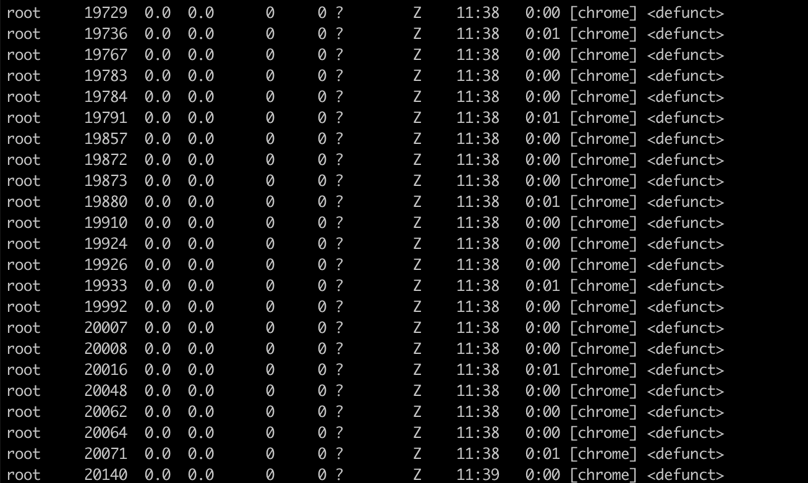

# 记一个没有遇到过的问题的解决思路

没想到啊没想到，自觉没能力写技术博客的我，为了提高自己的系统思维能力，也要被迫营业开始在自己早已荒疏的博客里添加一个简短的bug定位来让自己重新开始写博客了。

问题的场景是这样的：工作中遇到了一个通过pyecharts生成饼图的需求修改。pyecharts会通过python的subprocess模块启动一个chromium浏览器的子进程来渲染饼图的html，进而生成一张图片。由于我人为为制造的一个bug，导致了chromium的渲染进程无法顺利加载，长期的积累，导致docker容器的内存爆炸，最后的结局自然是内存溢出。发现了这个bug之后，我简单粗暴地捕获了异常，调用了browser.close()，可是意外地却发现了pyecharts的正常调用也会产生若干个chrome的僵尸进程（具体多少个取决于chromium启动时的某些参数设置），这样导致的结果就是进程号的无限增长，会慢慢将Linux的进程号用光，同样是一个问题。

作为一个合格的ctrl+C、ctrl+V程序员，遇事不决就Google和Stack Overflow。找到了pyecharts的issues里已经有人提过这个问题了，也有了被验证的解决方案。可是在我试用之后，发现在docker容器中手动启动的python进程是可以有效回收这些僵尸进程的，可是在宿主机中启动docker却仍然存在僵尸进程无法回收的问题。

于是只好“换个姿势，再来一次”。Google了一下在python中如何正确回收subprocess启动的子进程。在stackoverflow的一个问题[^1]里找到了答案:

```python
import signal
signal.signal(signal.SIGCHLD, signal.IGN) 
```

上面的处理逻辑是将子进程的退出信号忽略了，交由init进程来处理这个信号。

*作为一个没有系统学习操作系统知识的野路子程序员，深感自己真的不行。*

以上。

[^1]:https://stackoverflow.com/questions/6442428/how-to-use-popen-to-run-backgroud-process-and-avoid-zombie